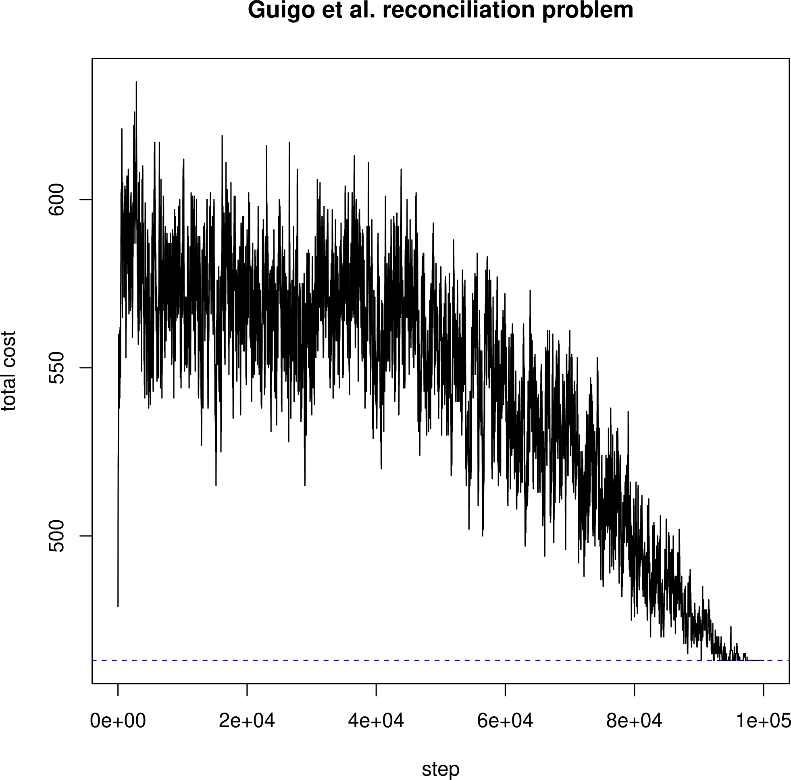

# segdup

## Introduction 

This C++ program implements our probabilistic algorithm for solving the problem gene tree - species tree reconciliation in the presence of segmental duplications.

It is written and maintained by Michael A. Charleston and Yao Ban Chan, in collaboration with Celine Scornavacca.

We have written a paper on this: *A probabilistic algorithm for gene-species reconciliation with segmental duplications*. It isn't yet published but if/when it is we will include a link to it here.

* _Michael Charleston_ : School of Natural Sciences, University of Tasmania, Australia (michael.charleston@utas.edu.au)
* _Yao-ban Chan_ : Melbourne Integrative Genomics and School of Mathematics and Statistics, The University of Melbourne, Melbourne, Victoria, Australia (yaoban@unimelb.edu.au)
* _Celine Scornavacca_ : Institut des Sciences de l’Evolution de Montpellier, Université de Montpellier, CNRS, IRD, EPH, Montpellier, France. (celine.scornavacca@umontpellier.fr)


## Abstract from our paper

Reconciliations are a mathematical tool to compare the phylogenetic trees of genes to the species that contain them, accounting for events such as gene duplication and loss. 
Traditional reconciliation methods have predominantly relied on parsimony to infer gene-only evolutionary events, and usually make the hypothesis that genes evolve independently. 
Recently, more advanced models have been developed that account for complex gene interactions stemming from phenomena such as segmental duplications, where multiple genes undergo simultaneous duplication. 
In this paper, we study the NP-hard problem of reconciling gene trees to a species tree with segmental duplications, without the aid of synteny information. 
We address this problem by proposing a novel probabilistic approach, imposing a Boltzmann distribution over the space of reconciliations. 
This allows for a Gibbs sampling-like Markov chain Monte Carlo algorithm that uses simulated annealing to effectively find or approximate the most parsimonious reconciliation, as demonstrated through rigorous simulations and re-analysis of an empirical dataset. 
Our findings present a promising new framework for addressing NP-hard reconciliation challenges in phylogenetics, enhancing our understanding of gene evolution and its relationship to species evolution.

## Keywords

reconciliation, segmental duplication, Boltzmann distribution

# Usage

`segdup` must be compiled using a C++11 or later compliant compiler, such as gcc. 
The compiled binary may be put anywhere in your directory structure, such as in users' home directory or `~/bin/`.

It should be run from command-line / terminal using `segdup` in such a way that the shell can find the executable (e.g. as `~/bin/segdup` or `segdup` if `~/bin` is in your $PATH variable), and arguments as below:

* `?` or `-h`
	- to print the help message
* `-S <newickformatspeciestree>`
	- Note that the species tree MUST be defined BEFORE the gene trees else the program will crash.
	- Also note that you MUST put trees in matched quotes if invoking from the command-line.
* `-G <newickformatgenetree> <leafassociations>`
	- Association list MUST be a quoted string of space-separated pairs such as 'p:A q:B' to mean
	- gene p is on species leaf A, and gene q is on species leaf B.
* `-n <int>`
	- to supply the number of steps for the main algorithm (default: 1000)
* `-Tinit <float>`
	- to supply the initial temperature (default: 0.1)
* `-d <float>`
	- to set the duplication event cost (default: 10.0)
* `-l <float>`
	- `to set the loss event cost (default: 1.0)
* `-o (probs|samples|trace)`
	- to output the sampled maps (default: FALSE): creates new file `segdup-samples.txt` for this.
	- to output the trace of progress (default: FALSE): creates new file `segdup-trace.csv` for this
* `--sat-spread <float>`
	- to set the Simulated Annealing "spread" parameter (default: 100)
* `--sat-decay <float>`
	- to set the Simulated Annealing "decay" parameter (default: 4)
* `--verbose`
	- to output lots of stuff (default: FALSE)
* `--silent`
	- to output as little as possible (default: FALSE)

## Examples

### Example 1

In the first example a single species tree is described using standard Newick format, with leaf labels A, B, C, then two gene trees.
Each gene tree is given in Newick format and is followed by a string of pairs in the form gene:species, to indicate in which (leaf) species the gene is found.

**Command:**

`> ./Release/segdup -S "(A,(B,C))" -G "(a,(b,c))" "a:A b:B c:C" -G "((d,e),f)" "d:A e:B f:C"`

**Output:**

```
Input Species tree S:
+----s1-------- A
     +----s2--- B
          +---- C

Input Gene tree G1:
+----g3-------- a
     +----g4--- b
          +---- c

Input Associations:
a:A
b:B
c:C
Input Gene tree G2:
+----g6---g7--- d
     |    +---- e
     +--------- f

Input Associations:
d:A
e:B
f:C
ORIGINAL MAP:
CophyMultiMap of 
	G1->S
	G2->S
S
+----s1-------- A
     +----s2--- B
          +---- C
G1
+----------[<]g3:s1-------------- a:A
           +----------[<]g4:s2--- b:B
                      +---------- c:C
G2
+----------[=]g6:s1---[<]g7:s1--- d:A
           |          +---------- e:B
           +--------------------- f:C
{Key: duplication marked by [=]; codivergence by [<].}
Events	Score	Map
1d+3l	13	g3:[<]s1,g4:[<]s2,g6:[=]s1,g7:[<]s1
Initial event counts and cost:
initCodiv,initDups,initLosses,initCost
3,1,3,13
Progress:
step,nCospec,nSegDup,nLoss,cost
100,1,5,15.000000
200,1,7,17.000000
300,1,7,17.000000
400,1,7,17.000000
500,1,5,15.000000
600,1,3,13.000000
700,1,7,17.000000
800,1,7,17.000000
900,1,3,13.000000
1000,1,3,13.000000
============================================================================
BEST Multiple CophyMap found by Algorithm 1:
CophyMultiMap of 
	G1->S
	G2->S
S
+----s1-------- A
     +----s2--- B
          +---- C
G1
+----------[<]g3:s1-------------- a:A
           +----------[<]g4:s2--- b:B
                      +---------- c:C
G2
+----------[=]g6:s1---[<]g7:s1--- d:A
           |          +---------- e:B
           +--------------------- f:C
{Key: duplication marked by [=]; codivergence by [<].}

nCospec,nSegDup,nLoss,cost
3,1,3,13
```

**Interpretation:**

`segdup` has used all the default values to search for the best (segmental) reconciliation between the two gene trees and the species tree.

It first displays all the trees in fancy ASCII characters, with all internal nodes labelled, and the leaf associations given.

Next it shows the initial reconciliation: the species tree, and then the gene trees.  
For each gene tree its internal nodes ('g' followed by an integer) are mapped to internal or leaf nodes of the species tree S (s followed by an integer).

For example in the first tree, G1, mapped above, node g3, which is the root of G1, is mapped to node s1 in S. 
The additional symbol '<' indicates an implied codivergence event; as opposed to the '=' symbol which indicates a duplication event.

Below the graphical display of the complete map is a rather terse description of this map, and a one-line table of the initial event counts and the total cost of the map.

Next is a "Progress" table which is populated every 100 steps (so can get rather long) of the progress of the Gibbs sampler: the step number, number of codivergence/cospeciation events, number of duplications including segmental ones, and total cost.

### Example 2

This example illustrates the use of supplying a file with command-line arguments to `segdup`:

```
> cat small-example.txt
-S "(A,(B,C))" -G "(a,(b,c))" "a:A b:B c:C" -G "((d,e),f)" "d:A e:B f:C"
> cat examples/small-example.txt | xargs ./Release/segdup
```

... which produces the same output as Example 1 above.

### Example 3 

This more complex example shows how `segdup` can be given a combination of arguments from input files and from the command-line:

`cat examples/ybc-case7.txt | xargs ./segdup -n 100000 -d 10.0 -l 0.1 -o samples -o trace  2>/dev/null`

... where the file ybc-case7.txt contains the following text:

```
-S "(A,(B,C))" -G "(a1,((a2,(b,c1)), c2))" "a1:A a2:A b:B c1:C c2:C" -G "(a,(c1,(c2,c3)))" "a:A c1:C c2:C c3:C"
```

This yields the output

```
Setting Number of steps to 100000
Setting DuplicationCost to 10
Setting LossCost to 0.1
Setting Show_Samples to true
Setting Save a Trace to true
Input Species tree S:
+----s1-------- A
     +----s2--- B
          +---- C

Input Gene tree G1:
+----g3------------------ a1
     +----g6---g7-------- a2
          |    +----g5--- b
          |         +---- c1
          +-------------- c2

Input Associations:
a1:A
a2:A
b:B
c1:C
c2:C
Input Gene tree G2:
+-----g8---------------- a
      +-----g9---------- c1
            +-----g10--- c2
                  +----- c3

Input Associations:
a:A
c1:C
c2:C
c3:C
Initial event counts and cost:
initCodiv,initDups,initLosses,initCost
3,4,4,40.4
============================================================================
BEST Multiple CophyMap found by Algorithm 1:
CophyMultiMap of 
	G1->S
	G2->S
S
+----s1-------- A
     +----s2--- B
          +---- C
G1
+----------[=]g3:s1------------------------------------ a1:A
           +----------[=]g6:s1---[<]g7:s1-------------- a2:A
                      |          +----------[<]g5:s2--- b:B
                      |                     +---------- c1:C
                      +-------------------------------- c2:C
G2
+-----------[=]g8:s1---------------------------- a:A
            +-----------[=]g9:s1---------------- c1:C
                        +-----------[=]g10:s1--- c2:C
                                    +----------- c3:C
{Key: duplication marked by [=]; codivergence by [<].}

nCospec,nSegDup,nLoss,cost
2,2,10,21
```

**Note** that the `-o trace` causes `segdup` to output a trace of the progress of the program in a file called `segdup-trace.csv`, which can be used to inspect the progress of `segdup` *post-hoc*.

The other `-o` (output) option, `-o sample`, causes `segdup` to output a list of all the unique maps found (as well as we can judge, based on a compact string description of the map) and the number of times each is encountered.
Not terribly useful unless you're hunting for bugs or something isn't going as expected.



----

_Last updated 2025-06-16 by MAC_
